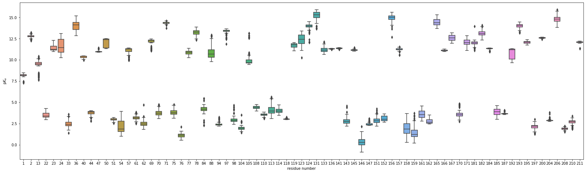
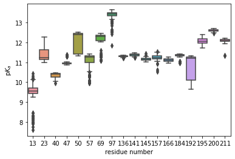

Example usage
=============

The following example requires that the ``MDAnalysisTest`` datafiles and ``seaborn`` packages are installed.
Both of these can be installed through pip:

.. code:: bash

	pip install MDAnalysisTests seaborn

pKa estimates from a molecular dynamics trajectory
--------------------------------------------------

We first import the paths to the test topology and trajectory and load them into an MDAnalysis ``Universe``.
This universe contains a trajectory of an adenylate kinase protein with 3341 atoms and 214 residues.

.. code:: python

	import MDAnalysis as mda
	from MDAnalysisTests.datafiles import PSF, DCD

	u = mda.Universe(PSF, DCD)

The pKa estimates of are generated by the PropkaTraj analysis class

.. code:: python

	import propkatraj

	pkatraj = propkatraj.PropkaTraj(u)
	pkatraj.run()

Once the run method has finished executing, the resulting pKa estimates, a function of residue number and time, can be found in the ``pkatraj.results.pkas`` as a panda dataframe.
The columns of the dataframe are the residue numbers and the DataFrame index is the time in nanoseconds.
These data can be visualized using matplotlib and seaborn:

.. code:: python

	import matplotlib.pyplot as plt
	import seaborn as sns

	fig = plt.figure(figsize=(28, 8))
	ax = fig.add_subplot(1,1,1)
	sns.boxplot(data=pkatraj.results.pkas, ax=ax)
	ax.set_xlabel("residue number")
	ax.set_ylabel(r"p$K_a$")
	plt.show()

Residues can easily be selected by using information stored in the original Universe.
For instance, assume we are only interested in the pKa distribution of the protein's lysines.
We can select all lysine residues by name and collect their **resids**, which are the columns in the DataFrame.

.. code:: python

	resides = u.select_atoms('resname LYS').residues.resids

	sns.boxplot(data=pkatraj.results.pkas[resids])
	ax = plt.gca()
	ax.set_xlabel('residue number')
	ax.set_ylabel(r'p$K_a$')
	plt.show()

